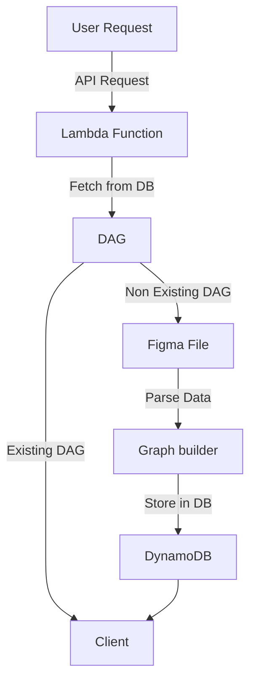
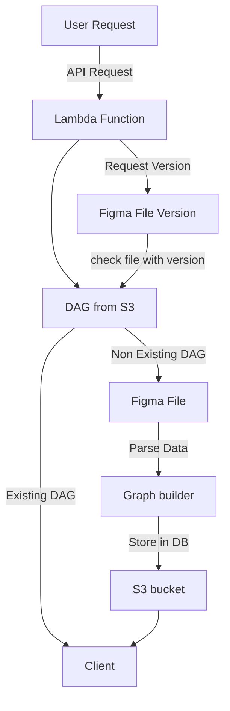

# Figma to DAG

This project converts Figma file data to a Directed Acyclic Graph (DAG).

## Table of Contents

- [Prerequisites](#prerequisites)
- [Usage](#usage)
- [Project Structure](#project-structure)
- [Testing](#testing)
- [My Intuition and Building Process](#my-intuition-and-building-process)
- [Deliverables](#deliverables)
- [Using API](#using-api)

### Prerequisites

Before using the deploy script, ensure you have the following:

- AWS CLI configured with appropriate credentials
- Figma API access token

### Usage

```sh
chmod +x deploy.sh
./deploy.sh
```

The script will perform the following actions:

- Build the project, create a s3 bucket for the DAG
- Upload assets to S3
- Create a lambda function to handle the DAG conversion

## Project Structure

```sh
.
├── Readme.md
├── deploy.sh
├── package.json
├── samconfig.toml
├── src
│   ├── __tests__
│   ├── handlers
│   │   └── figmaHandler.mjs // Lambda function to handle the DAG conversion
│   ├── models // Graph model
│   └── utils // Utility functions for Figma and S3
└── template.yaml
```

## Testing

Jest is used to test the Graph model to test DAG building and various graph edge cases.

```sh
npm run test
```

## My Intuition and Building Process.

Requirements:

1. Graph Construction:

- To construct the graph I need to created nodes and edges.

> Node creation

- Nodes wil be created from Figma frame, page or other components like (Text, Rectange, etc)
- I need to store the nodes with `id`, `label` and `image`.

> Edge creation

- Edges will be created from Figma node interations like `hover`, `click`, `drag` etc.
- I need to handle Click, Hover, Drag, Keypress and Scroll interactions.
- I need to save edges as `sourceId`, `targetId` for retrieval and edge data will have `action`, `label` and `image`.
- A special requirement for label is that it should be descriptive (eg: Click on Node A).
- Graph should be a Directed Acyclic Graph and should be represented as adjacency matrix.
- Lastly I need to use DFS for graph traversal.

2. Cleaning up Figma data:

- For each node I need to get `id`, `label` and `image` and store it as a node object.
- The image is currently a ref and not the actual image. - This can be fetched through some other API.
- Every node has childrens property and interactiosn with actions.
- I need to filter out the childrens and interactions to get the required data.
  (action, label, image)

```text
Generalisation:
data = n
getData(n) ->
                - take node[n]
                - check node[n] is frame/page or component
                    - Get data
                    - Skip it
                - check node[n] has childrens
                    - we need to go through all childrens.
                    - check for interactions property.
                       - check for actions property.
                           - Get the destinationid from the action.
                           - Build the edge with sourceId of node[n] and targetId as destinationId.
                           - Label will be built as `actionType on node[n]`.
                - Base case:
                    - if node[n] has no childrens we return the data.


```

3. Integrating with DB:

- We need to somehow store the graph with version and file key for future access.
- We need to check if the graph for a figma file already exists in the DB using version as a matching parameter.
- If Graph exists we don't need to build the graph again using figma data.
- I can use DynamoDB to store graph nodes and edges with version and file keys.

- High level Design:



Challenges:

- The figmaHanlder calls the figma API to fetch file data.
- Data is huge and the lambda sometimes time out or crashes due to memory issues.
- We need to figure out an effiecient way to fix this.
- Storing the nodes and edges in DynamoDB is not a good idea since we need to fetch the data multiple times and data is huge and versioned.

Improvements:

- The handler can be improved by using another API call to get the file version first.
- We can then fetch the data from DB if the version matches.
- We can store the graph in S3 with version and file key. S3 is better choice since we can fetch the data multiple times and data is huge and json serializable.



### Deliverables:

- Fully implemented Lambda Function and supported, modular, clean, well-tested code. - Done
- deploy.sh script for deploying the Lambda Function to AWS, and for any setup of database(s). - Done
- README.md - Done
- Working integration with db for storing and retrieving DAGs. - Done
- Ensure HTTPS endpoint works - Done
- Successful testing with the provided Figma prototypes. - Done

### Using API

```sh
curl -X POST https://<api-gateway-url>/figmaToDAG -H "Content-Type: application/json" -d '{"file_key": "<figma-file-key>", "access_token": "<figma-access-token>", "build_adjacency_matrix": "<true/false>"}'
```
